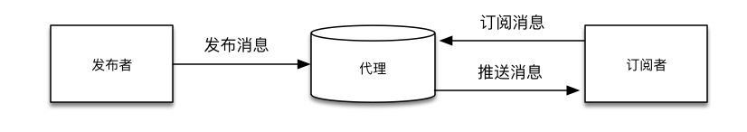
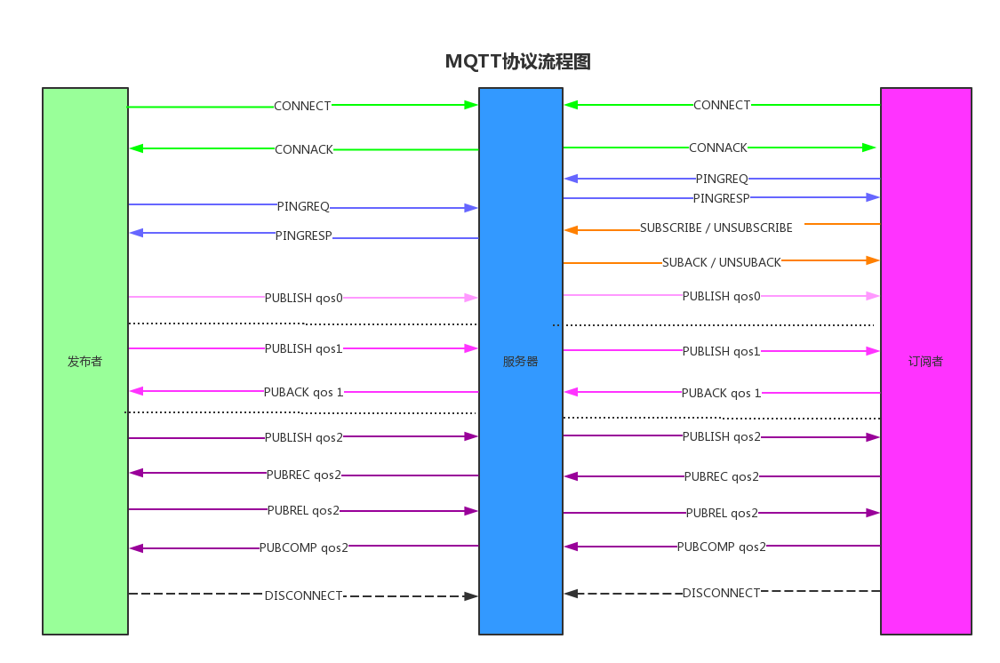

# MQTT协议简单学习 #

MQTT（ Message Queuing Telemetry Transport）是一个物联网传输协议，它被设计用于轻量级的发布/订阅式消息传输，旨在为低带宽和不稳定的网络环境中的物联网设备提供可靠的网络服务。MQTT是专门针对物联网开发的轻量级传输协议。MQTT协议针对低带宽网络，低计算能力的设备，做了特殊的优化，使得其能适应各种物联网应用场景。

## MQTT的特点与优势 ##

- 使用发布／订阅消息模式，提供一对多消息发布；
- 使用TCP/IP进行网络连接（也有基于UDP版本的MQTT-SN）；
- 具有三种消息发布服务质量选项；
  - “至多一次”。通常app的推送使用的就是这种模式；也就是说，如果移动设备在消息推送的时候没有联网，那么再次联网就不会收到通知了；
  - “至少一次”，可以确保消息收到，但消息可能会重复；
  - “只有一次”，确保消息到达一次，比如计费系统， 如果出现消息重复或者丢失会导致系统结果不正确的问题；
- 小型传输，开销很小（固定长度的头部是2字节），协议交换最小化，以降低网络流量；
- 通知有关各方客户端异常中断的机制；

## MQTT协议实现方式 ##

发布者(Publish)。发布者其实是客户端，可以进行发布消息；
代理(Broker)。代理指的是MQTT服务器；
订阅者(Subscribe)。一般指的是客户端，发布者同时也可以是订阅者；

### MQTT客户端 ###

一般情况下，客户端需要实现以下功能：

- 给其他客户端发布订阅的信息；
- 订阅其他客户端发布的信息；
- 退订和订阅主题；
- 断开服务器连接。

### MQTT服务端 ###

MQTT服务端也称为消息代理，经常你会听到broker这个词。它可以实现以下功能：

- 接收来自客户端的网络连接；
- 接受客户发布的应用信息；
- 处理来自客户端主题订阅和退订请求；
- 向订阅的客户端转发应用程序消息；

## MQTT协议流程 ##

## MQTT的服务端与客户端 ##

可以在https://github.com/mqtt/mqtt.github.io/wiki/software?id=software中找到相关的服务端与客户端

## MQTT协议规范 ##

中文版：https://github.com/mcxiaoke/mqtt

英文版：http://docs.oasis-open.org/mqtt/mqtt/v3.1.1/mqtt-v3.1.1.html
