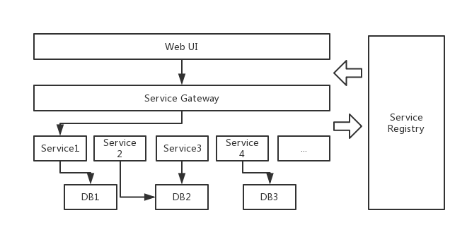

# 不得不说的微服务 #

“微服务”架构是近期软件应用领域非常热门的概念。在规划IOT平台架构的时候，我们选择了微服务架构。下面来说说微服务架构，让在使用的时候能有个大概的了解。

## 常用的单体架构 ##

单体架构（单块架构），指的是一个安装包（如war等）包含了所有的功能的应用程序。

### 单体架构的优点 ###

- 易于开发；
- 易于测试；
- 易于部署；
- 易于水平伸缩；

### 单体架构面临的挑战 ###

- 复杂性高，维护成本增加；
- 持续交付周期长；
- 技术选型成本高；
- 可扩展性差；
- 技术债务，新手接手难度大；

## 什么是微服务 ##

微服务架构风格是一种将一个单一应用程序开发为一组小型服务的方法，每个服务运行在自己的进程中，服务间通信采用轻量级通信机制。这些服务围绕业务能力构建并且可通过全自动部署机制独立部署。这些服务共用一个最小型的集中式的管理，服务可用不同的语言开发，使用不同的数据存储技术。

通过以上的描述，我们可以获得以下的一些点：

- 微型服务（代码行数少；花费的时间短；）
- 单一职责；
- 轻量级通信；
- 独立性；
- 进程隔离；

## 微服务的优势和挑战 ##

微服务能够流行肯定是有它显著的优点所在，但微服务架构也为我们带来了不少的挑战。

### 微服务优点 ###

- 服务简单，只关注一个业务功能；
- 每个微服务可由不同团队开发；
- 微服务是松散耦合的；
- 可用不同的编程语言与工具开发；
- 按需伸缩；

### 微服务面临的挑战 ###

- 运维要求高；
- 分布式系统的复杂性；
- 重复劳动；
- 接口调整成本大；
- 难度较高的异步编程、消息与并行；

## 微服务的设计原则 ##

每个架构都是基于某些设计原则而形成的，微服务也是。以下是一些微服务的设计原则：

- 隔离
- 服务自治
- 单一责任
- 有界上下文
- 异步通信
- 位置独立

## 微服务与SOA ##

微服务在概念上是SOA的一个子集；但在实现上，它是一种更符合现代化互联网发展趋势的实践，是一种更容易帮助企业有效并成功实施服务架构的实践。

|  SOA实现        |  微服务架构    |
| ------------- | ------------- |
| 企业级，自上向下开展实施      | 团队级，自下向上开展实施 |
| 服务由多个子系统组成，粒度大      | 一个系统拆分成多个服务，粒度小      |
| 企业服务总线，集中式的服务架构 | 无集中式总线，松散的服务架构      |
| 集中方式复杂（ESB/WS/SOAP）| 集中方式简单（HTTP/REST/RCP） |
| 单块架构系统，相互依赖，部署复杂 | 服务能独立部署 |

## 微服务架构图 ##

## 微服务的本质 ##

- 服务作为组件
- 围绕业务组织团队
- 关注产品而非项目
- 技术多样性
- 业务数据独立
- 基础设施自动化
- 演进式架构

---
参考：
《微服务架构与实践》
《Spring Cloud与Docker微服务架构实战》
《架构探险——轻量级微服务架构》