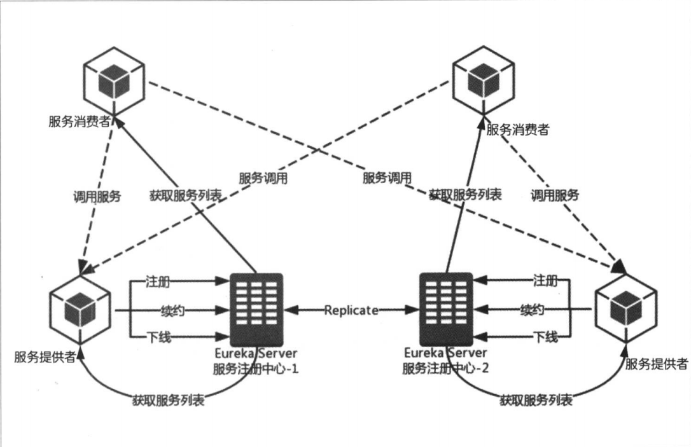

# 服务注册与服务发现 #

提到微服务，我们不得不提下服务治理。

在微服务架构中，我们会维护一个Service Registry（服务注册表），它是整个微服务架构的核心。它不仅仅提供了服务注册的功能，还提供了服务发现的功能。

## 服务注册 ##

在微服务架构中，存在一个注册中心，每个服务单元向注册中心登记自己提供的服务，将主机、端口号、版本号、通信协议等一些附加信息告知注册中心，注册中心按服务名分类组织服务清单。服务注册中心会以心跳的方式去检测清单中的服务是否可用，若不可用需要从服务清单中剔除，达到排除故障服务的效果。

在Spring Cloud中，我们使用`spring-cloud-starter-eureka-server`实现服务注册功能。很幸运的是，eureka-server几乎就是一个可以直接使用的项目。在引入依赖后，稍微进行配置就可以满足你的注册中心的需求。

    <dependencies>
        <dependency>
            <groupId>org.springframework.boot</groupId>
            <artifactId>spring-boot-starter-actuator</artifactId>
        </dependency>
        <dependency>
            <groupId>org.springframework.cloud</groupId>
            <artifactId>spring-cloud-starter-eureka-server</artifactId>
        </dependency>

        <dependency>
            <groupId>org.springframework.boot</groupId>
            <artifactId>spring-boot-starter-test</artifactId>
            <scope>test</scope>
        </dependency>
    </dependencies>

配置文件如下：

    spring:
    application:
        name: service-registry-center
    server:
    port: ${port}
    eureka:
    client:
        service-url:
        defaultZone: ${defaultZone}
    instance:
        instance-id: ${spring.cloud.client.ipAddress}:${port}

上面代码中的${port},${defaultZone}和${spring.cloud.client.ipAddress}:${port}可以由外部直接传入，也可以修改为具体的某个值。

在主程序入口使用`@EnableEurekaServer`注释类。

启动服务，在浏览器中输入：`http://localhost:端口号/eureka`即可。

## 服务发现 ##

在服务治理的框架下，服务间的调用不再通过指定具体的实例地址来实现，而是通过向服务名发起请求调用实现。所以，服务调用在调用服务提供方接口的时候，并不知道具体的服务实例位置。这样就需要服务调用方向服务注册中心获取服务的实例清单，以实现对服务实例进行访问。

Eureka既提供了服务端也提供了客户端，我们可以通过引用`spring-cloud-starter-eureka`来实现。

早主程序入口，使用`@EnableDiscoveryClient`注释。

在配置文件中，配置：`eureka.client.serviceUrl.defaultZone=http://localhost:端口号/eureka`。

启动服务，在eureka的服务端中可以看到注册的服务。

## 服务治理的角色 ##

在服务治理体系中有三个核心角色：服务注册中心、服务提供者和服务消费者。这三者的关系可以如下描述：

1. 每个服务（提供者和消费者）在启动的时候，将自己的信息注册到服务注册中心中。
1. 服务消费者从服务注册中心获得服务提供者的信息，并根据该信息调用服务提供者的接口。
1. 各个服务与注册中心使用一定机制（如：心跳）通信。注册中心如果长时间无法与某服务通信，就会注销该服务。
1. 服务的信息发生变更的时候，会重新注册到注册中心。使用这种方法，服务消费者就无须人工修改服务提供者的信息。

所以，我们可以得到以下的结构图：

